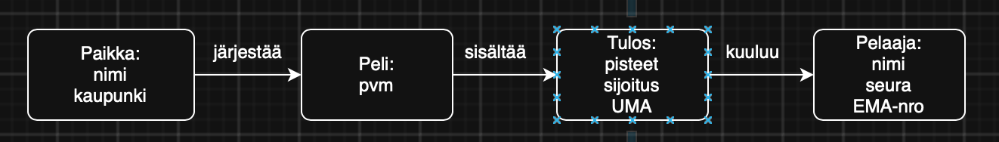
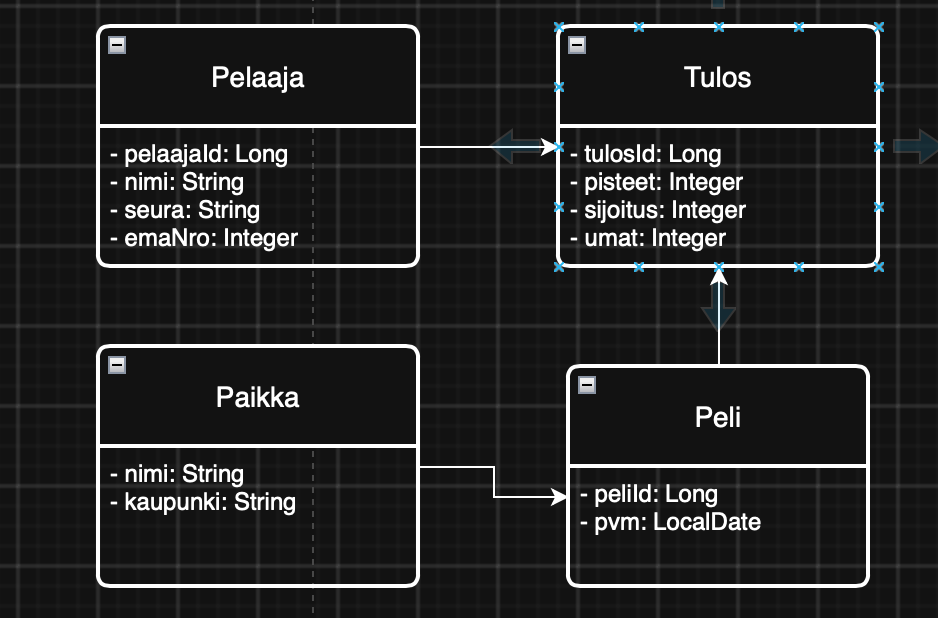
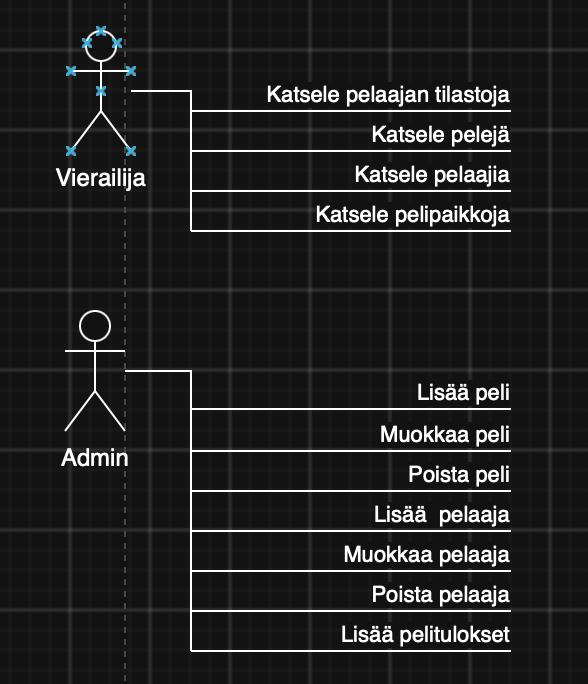
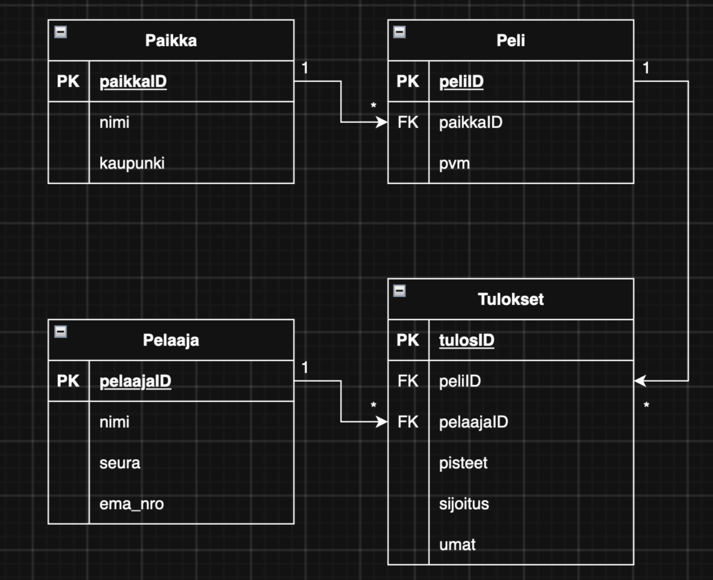

# Riichi Mahjong Tracker

Harjoitustyön aiheena on riichi-mahjongin pelien ja pelaajien tilastojen hallintaan tarkoitettu verkkosovellus. Sovelluksessa voidaan tallentaa pelattuja riichi-mahjong-pelejä, niissä mukana olleita pelaajia, pelaajien saamia pisteitä ja sijoituksia sekä pelien pelipaikkoja.

## Ominaisuudet
### Julkinen näkymä

- Tallennettujen pelien, pelaajien ja pelipaikkojen tarkastelu
- Peljaakohtaisten tilastojen tarkastelu:
  - Pelien määrä
  - Voittojen määrä
  - Keskimääräinen sijoitus
  - Keskimääräinen pistemäärä
  - Keskimääräinen uma-piste (pistesäätö, jolla annetaan lisäpisteitä parhaiten sijoittuneille ja vähennetään pisteitä huonommin sijoittuneilta pelin lopussa)

### Hallinta näkymä
- Pelien, pelaajien ja pelipaikkojen hallinta (lisäys, muokkaus, poisto)
- Pelitulosten tallentaminen

### REST-rajapinta
Sovellukseen toteutetaan myös REST-rajapinta, jonka kautta pelien ja pelaajien tietoja voidaan hakea JSON-muodossa.

### Tietomalli
Sovelluksen tietokanta koostuu vähintään seuraavista entiteeteistä:
 - Pelaajat
 - Pelit
 - Pelipaikat
 - Pelitulokset
  
 Yksi peli liittyy yhteen pelipaikkaan ja sisältää neljä pelaajakohtaista tulosta. Sama pelaaja voi osallistua useisiin peleihin.

 

## Käyttöliittymä 

## Tietokanta

## Tietohakemistokuvaus

| **Taulu** | **Attribuutti** | **Selitys**                      |
|-----------|-----------------|----------------------------------|
| Pelaaja   | pelaajaID       | Pelaajan yksilöllinen tunniste   |
|           | nimi            | Pelaajan nimi                    |
|           | seura           | Pelaajan edustama seura          |
|           | ema_nro         | Pelaajan EMA-numero              |
| Peli      | peliID          | Pelin yksilöllinen tunniste      |
|           | paikkaID        | Pelipaikan tunniste              |
|           | pvm             | Pelin päivämäärä                 |
| Paikka    | paikkaID        | Pelipaikan yksilöllinen tunniste |
|           | nimi            | Pelipaikan nimi (seura)          |
|           | kaupunki        | Kaupunki, jossa paikka sijaitsee |
| Tulos     | peliID          | Peli, johon tulos liittyy        |
|           | pelaajaID       | Pelaajalle, jolle tulos kuuluu   |
|           | pisteet         | Pelaajan pelissä saamat pisteet  |
|           | sijoitus        | Pelaajan lopullinen sijoitus     |
|           | uma             | Pelaajan pelistä saama UMA       |